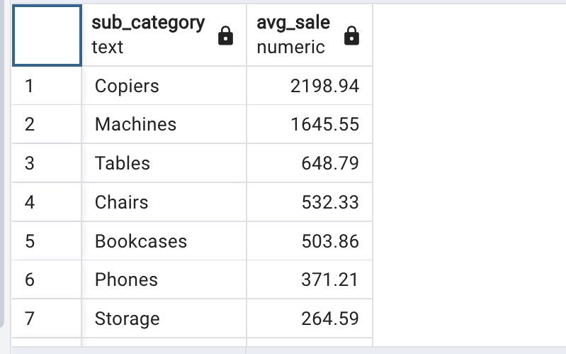
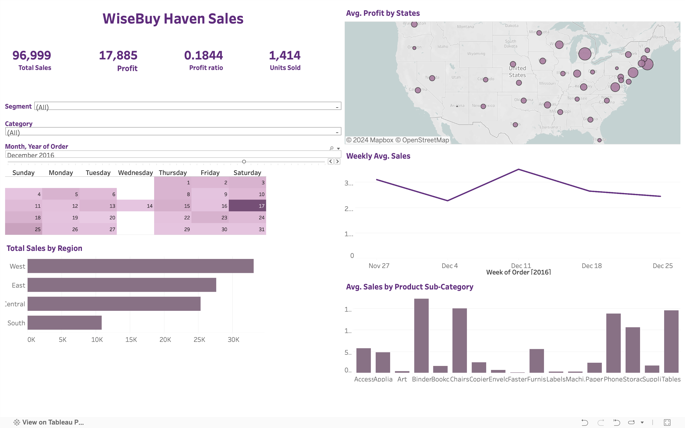

# WiseBuy Haven

SQL | PostgreSQL | Tableau

# Introduction

WiseBuy Haven, a prominent shopping mall chain has observed fluctuations in sales and profitability across its stores nationwide. The Executive team seeks to optimize its operations and enhance profitability by leveraging data-driven insights.  WiseBuy Haven's management has tasked the data analysis team with a comprehensive review of the company's sales performance.

# Objective:

The goal of this project is to provide WiseBuy Haven with executable insights by addressing the following key questions:

1. What regions have made the most sales?
2. Which states have turned out to be more profitable?
3. Derive the average sales by product sub-category
4. Which year had the highest Weekly average sale?
5. What is the total profit ratio over years?

# Data

The dataset used in this analysis contains information about customers close to 1000 and the dataset is available in this repo.

Information on the dataset include:

 `profit`, `postal_code`, `sales` , `quantity` , `discount` , `customer_name`, `segment`,
 `country`, `city`, `state`, `order_id`, `region`, `product_id`, `category`, `sub_category`,
 `product_name`, `order_date`, `ship_date`, `ship_mode`, `customer_id`

# SQL Analytical Queries

- `data_cleaning.sql`: query for data cleaning and data exploration
- `query_visualization.sql`: query for data visualization in Tableau

# Graphs and Charts

- KPIs
- Calendar
- U.S Map
- Bar Chart
- Line Chart
- Interactive Dashboard

#### Availabe in the packaged Tableau Workbook ; `wise_workbook.twbx`

# Analytical Results

Brief findings of this project are:
1. West region has the highest sales followed by East.
2. California, New york are, Texas, Washington and Pennsylvania are the most profitable states.
       - California: 457687.63,
       - New York: 310876.27,
       - Texas: 170188.05,
       - Washington: 138641.27,
       - Pennsylvania: 116511.91,

       - Top 5 States' Total Profit = 457687.63 + 310876.27 + 170188.05 + 138641.27 + 116511.91 = 1,194,905.13
       - Total Profit of all states = 457687.63 + 310876.27 + 170188.05 + 138641.27 + 116511.91 + ... = 1,353,011.16
       - Calculating the percentage of total profits of the top 5 states
            Percentage = ( Top 5 States' Total Profit / Total Profit ) * 100 = (1,194,905.13/1,353,011.16) * 100 
            Percentage = 52%
    - So, the top 5 states accounted for approximately 52% of the total profits.
   
3. Average sales by product sub-category are:

4. "2006" had the highest Weekly average sale.
5. "Illinois" has the lowest monthly profit margin.

# Final Report

- Available in the tableau workbook file `wise_workbook.twbx`.

